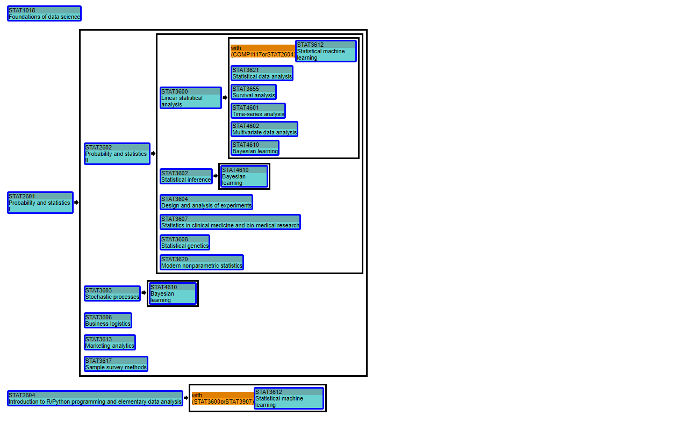

  
  <h3>📚 HKU Course Planner</h3>
  
Navigate Your Academic Success with HKU Course Planner

## :rocket: Features Overview

- Visualize of pre-reg relationship of courses

  
  
We visualzied the complex relationship of the complex pre-reg relationship of courses, the graph is rendered in real time when user click on any program in the side bar in the View Major Minor page

- Course Planner (experimental)

  
  
This is planner for planning the study plan among the whole unversity studies, the planner allow user to place courses to take by drag and drop. For courses that its pre-reg course is planned to take would show in green, for those pre-reg is not fulfill it will be in red, for those have excludsive course taken, it will be in orange. 

  Current Issue
  <ul>
    <li>For courses with special pre-reg condition, the graph cannot determine if the condition is passed</li>
    <li>
      In the below cases, the problem of double count on credit will show up in the credit counter of program/major/minor, while double count is not allow among most major and minor
      <ul>
        <li>If a program and major/minor both have the same course as its requirement, i.e. minor in FINA and minor in ECON</li>
        <li>If a course can be used to fulfill more than one requirement of the same program/major/minor, i.e. in double major in CS, COMP3297 can be used to count as an elective course or capstone experience, however, this double counting is not allowed</li>
      </ul>
    </li>
    <li>Also for some major, double count for some courses is allowed, under some condition, i.e. science school students take science school major as their second major, also for FBE student, however, the current version cannot handle this double count well</li>
    <li>For some courses, i.e. engine training for engine students, it only open in summer sem, but the problem don't notice this</li>
  </ul>

## :bulb: Start Planning Today

<https://ivan8882004.github.io/HKUCoursePlanner-Reviewer/>

## :handshake: Contributing

If you find any bugs or have suggestions for improvement, please feel free to create an issue.

_p.s. Star this project & share it with your friends if it helped!_ 😉
