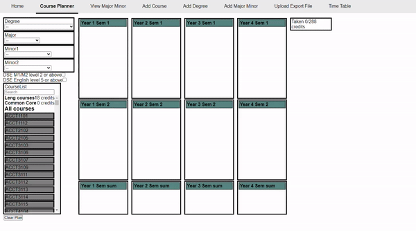
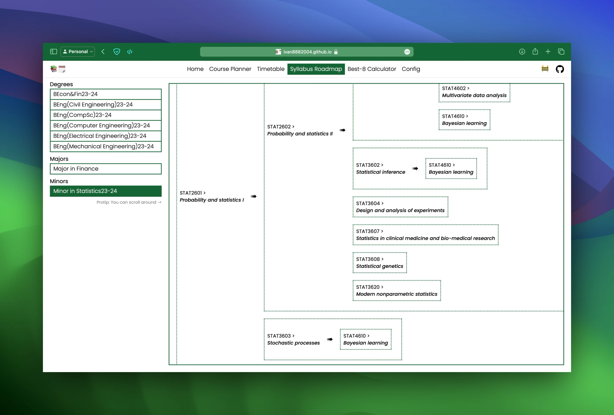
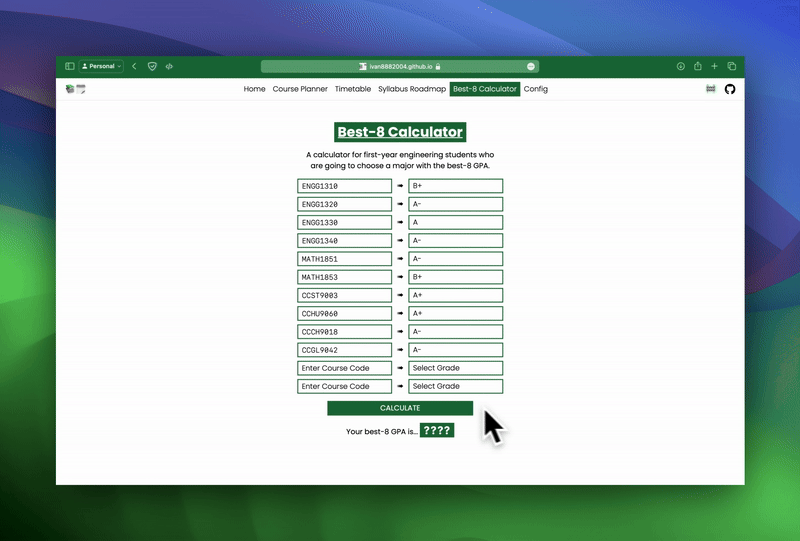

# Course Planner 📚🗓️

Visualise and plan your academic journey

Developed by HKU students, for HKU students.

*[Click me to start planning today!](https://ivan8882004.github.io/HKUCoursePlanner-Reviewer/)*

## :rocket: Features

### Timetable - *Schedule Your Semester*

### Course Planner - *Create a Study Plan*

### Syllabus Roadmap - *A Visual Guide through Your Syllabus*

### Best-8 GPA Calculator - *For First Year Engineering Students :heart:*

#### What are you waiting for?

[*Give it a try!*]((https://ivan8882004.github.io/HKUCoursePlanner-Reviewer/))

## :handshake: Contributing

If you find any bugs or have suggestions for improvement, please feel free to create an issue.

*p.s. Star this project & share it with your friends if it helped!* :wink:

## 💻 Devs

- [**Walter-Tong**](https://github.com/Walter-Tong)
  - Visualization of prerequisite relationships among courses
  - Course Planner page
  - Config editing pages
  - Preview of courses on Timetable
- [**ivan8882004**](https://github.com/ivan8882004) - Timetable page
- [**kennethkn**](https://github.com/kennethkn) - UI/UX redesign, feature refinements & branding
