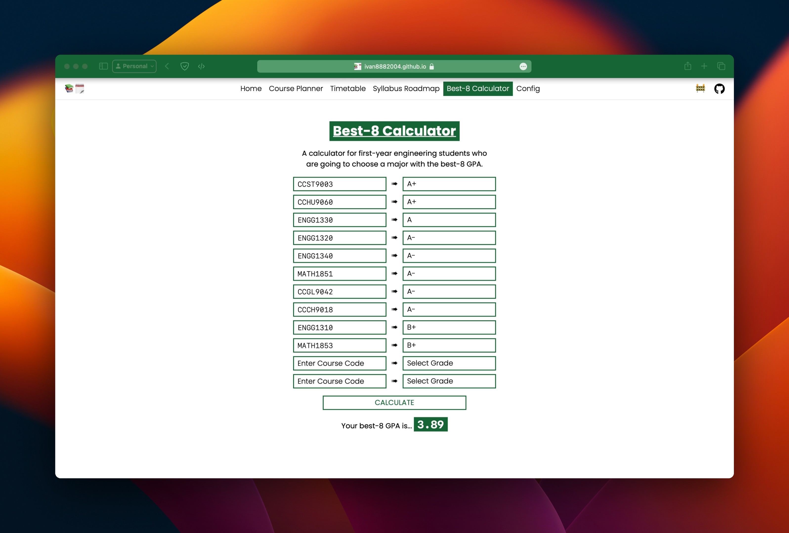

# Course Planner 📚🗓️

Visualise and plan your academic journey

[Click me to start planning today!](https://ivan8882004.github.io/HKUCoursePlanner-Reviewer/)

## :rocket: Features

### Syllabus Roadmap - A Visual Guide through Your Syllabus

### Best-8 GPA Calculator for First Year Engineering Students

## :handshake: Contributing

If you find any bugs or have suggestions for improvement, please feel free to create an issue.

_p.s. Star this project & share it with your friends if it helped!_ 😉

## 💻 Devs

- [**Walter-Tong**](https://github.com/Walter-Tong)
  - Visualization of prerequisite relationships among courses
  - Course Planner page
  - Config editing pages
  - Preview of courses on Timetable
- [**ivan8882004**](https://github.com/ivan8882004) - timetable page
- [**kennethkn**](https://github.com/kennethkn) - UI/UX redesign & feature refinements
